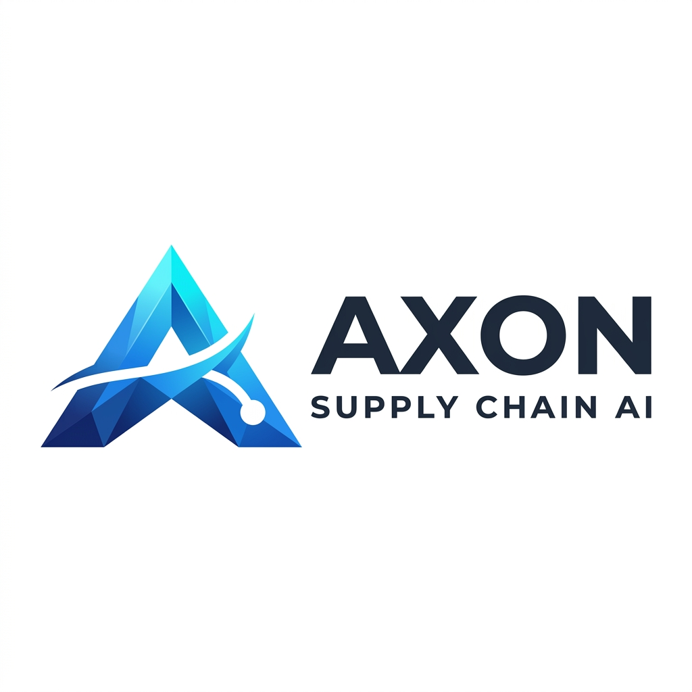

<div align="center">
  
  <h1>🚚 Cargofy</h1>
  <p><b>AI-Powered Autonomous Cold Chain Intelligence Platform</b></p>
  <p><i>FAR AWAY 2026 Hackathon: Logistics & Transit x Agentic & Autonomous Systems</i></p>
</div>

---

## ⚠️ The Real Problem

Every night in India, truckloads of milk, life-saving medicines, and fresh produce silently spoil. 
- **Rs. 92,000 crore** lost annually to cold chain failures (ASSOCHAM 2024).
- **40%** of India's perishables spoil before ever reaching consumers.
- No alarm goes off. No driver is notified. No rerouting happens until the goods are already ruined.

Existing solutions are purely reactive: they send alerts **after** the damage is done.  
**Cargofy does not just alert. It ACTS.**

> *Traditional:* Temperature rises ➔ Alert sent ➔ Human decides ➔ Action (too late)  
> *Cargofy:* Temperature rises ➔ AI Agent Predicts Failure ➔ Optimal Route Found ➔ Driver WhatsApp'd ➔ Crisis Avoided

---

## 🎯 Key Features

Cargofy is a fully functional end-to-end platform blending hardware simulation, predictive AI, and real-time operations.

### 1. 🤖 Autonomous Rerouting Agent (Google ADK + Gemini 2.0 Flash)
- **Predictive Intelligence:** Predicts battery or AC failure *before* temperature breaches critical thresholds.
- **Agentic Action:** Automatically calculates the nearest cold-storage facility and dispatches rerouting instructions without human intervention.
- **Live WebSocket Feed:** Streams agent decisions directly to the control tower dashboard.

### 2. 🗺️ 3D Fleet Visualization & Control Tower
- **Real-Time 3D Map:** Built with Mapbox GL JS featuring 3D terrain, pitch, fog, and star field.
- **Risk-Colored Telemetry:** Animated truck markers shift colors based on predictive risk scores (GREEN/AMBER/ORANGE/RED).
- **Auto-Tracking Camera:** The map camera automatically locks onto shipments experiencing `CRITICAL` events.

### 3. 📱 Free WhatsApp Alerts (Zero-Cost CallMeBot)
- Instant, automated WhatsApp messages sent to drivers the moment an AI intervention is triggered (e.g., *"Milk spoiling in 35 mins! Take a right towards Vashi Cold Hub."*).

### 4. 🔗 Blockchain Audit Trail (Ethereum Sepolia Testnet)
- Immutable, on-chain recording of shipment conditions.
- Smart contracts (`CargofyShipmentAudit.sol`) finalize verdicts (SAFE / SPOILED / PARTIAL) to guarantee transparent accountability for logistics providers.

### 5. 🇮🇳 PM Gati Shakti & ULIP Integration
- **Vahan API (Simulated):** Real-time vehicle compliance, pollution checks, and registration verification.
- **Sarathi API (Simulated):** Instant driver background and license verification.

---

## 🧠 Architecture

```text
[ IoT Sensor / Simulator ] 
         ↓
[ FastAPI Backend ] ──────────────→ [ Risk Engine (Gemini) ]
         ↓                                     ↓
[ WebSocket 3D Map ] ←────── [ Rerouting Agent (Google ADK) ]
         ↓                                     ↓
[ Blockchain Ledger ]                 [ WhatsApp Alert ]
```

---

## 💻 Tech Stack

| Layer | Technology |
|---|---|
| **Frontend** | React, TypeScript, Vite, TailwindCSS, Mapbox GL JS |
| **Backend** | FastAPI, Python, SQLAlchemy, PostgreSQL (Supabase) |
| **AI / Agentic** | Google ADK 1.31, Gemini 2.0 Flash, Gemma 2 |
| **Real-time** | WebSockets, Firebase RTDB, Google Pub/Sub |
| **Blockchain** | Ethereum Sepolia Testnet (Solidity, web3.py) |
| **Integrations** | CallMeBot (WhatsApp), ULIP (Vahan/Sarathi), OpenWeather |

---

## 📂 Repository Structure

```text
Cargofy/
├── backend/
│   ├── app/
│   │   ├── agents/        # Autonomous Rerouting & Dispatch Agents
│   │   ├── routers/       # 25+ FastAPI endpoints (blockchain, ulip, agent)
│   │   ├── services/      # AI, Maps, Telemetry, and Alerting services
│   │   └── main.py        # Application entrypoint
│   └── tests/             # Backend API and Database tests
├── frontend/
│   ├── src/
│   │   ├── components/    
│   │   │   ├── maps/      # 3D Fleet & Cargo Maps
│   │   │   └── ui/        # Shared UI components (Badges, Command Bar)
│   │   ├── pages/         
│   │   │   ├── dashboard/ # Live Control Tower, Analytics, Fleet Tracking
│   │   │   ├── marketing/ # Landing, Pricing, About pages
│   │   │   └── auth/      # Login & Signup flows
│   │   └── lib/           # Supabase & Axios API configuration
├── blockchain/
│   └── contracts/         # CargofyShipmentAudit.sol
└── hardware/              # (Bonus) Custom ESP32+DS18B20 PCB designs
```

---

## 🚀 Quick Start

### 1. Backend Setup
```bash
cd backend
python -m venv venv
source venv/bin/activate  # (or `venv\Scripts\activate` on Windows)
pip install -r requirements.txt
cp .env.example .env      # Add your API keys (Gemini, Supabase, Mapbox)
uvicorn app.main:app --reload --port 8000
```

### 2. Frontend Setup
```bash
cd frontend
npm install
npm run dev
```

### 3. Trigger an Agentic Simulation
You can trigger a simulated critical battery failure to watch the AI Agent spring into action:
```bash
curl -X POST http://localhost:8000/api/v1/agent/simulate-critical \
  -H "Content-Type: application/json" \
  -d '{"scenario": "battery_failure", "shipment_id": "SHP-DEMO-001"}'
```
*Watch the dashboard 3D map fly to the truck, risk levels spike, and a WhatsApp alert fire!*

---

## 🌐 Live Deployment
- **Frontend App:** [https://cargofy-live-2026.web.app](https://cargofy-live-2026.web.app)
- **Backend API:** Hosted on Google Cloud Run (`asia-south1`)
- **Database:** Supabase PostgreSQL

---

*Built with ❤️ for FAR AWAY 2026 Hackathon.*