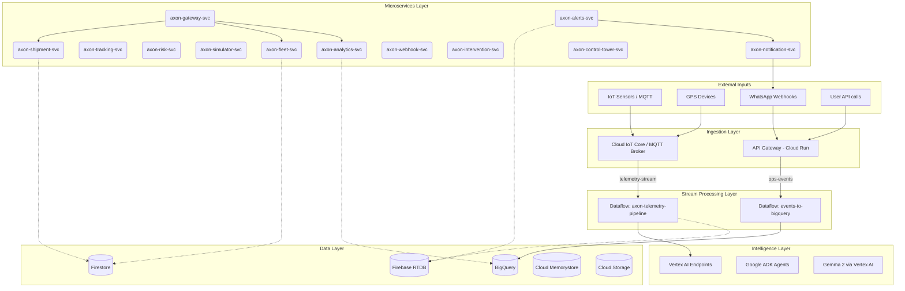

# 🏗️ AXON — Master Backend Architecture & Infrastructure

**Document Type:** Complete System Reference  
**Stack:** Google Cloud Platform · Google ADK · Gemma 2 · Vertex AI · Cloud Run · Firebase · Mapbox · Pub/Sub · BigQuery · Dataflow

---

## 🌐 Complete System Architecture



---

## 🛠️ All Cloud Run Microservices

| Service | Language | Memory | Min Instances | Purpose |
|---|---|---|---|---|
| `axon-gateway-svc` | Node.js | 256MB | 2 | Auth + routing |
| `axon-shipment-svc` | Node.js | 512MB | 2 | Shipment CRUD + detail |
| `axon-tracking-svc` | Node.js | 512MB | 2 | Live tracking API |
| `axon-risk-svc` | Python | 1GB | 2 | Risk score API + explanations |
| `axon-alerts-svc` | Node.js | 512MB | 2 | Alert creation + delivery |
| `axon-simulator-svc` | Node.js | 256MB | 1 | Synthetic telemetry emitter |
| `axon-analytics-svc` | Python | 1GB | 1 | BigQuery analytics API |
| `axon-fleet-svc` | Node.js | 256MB | 1 | Driver + vehicle management |
| `axon-intervention-svc` | Python | 512MB | 1 | Execute intervention actions |
| `axon-webhook-svc` | Node.js | 128MB | 1 | WhatsApp webhook handler |
| `axon-notification-svc` | Node.js | 128MB | 1 | FCM + SMS dispatcher |
| `axon-control-tower-svc` | Node.js | 512MB | 2 | Control Tower aggregation |
| `axon-report-generator` | Python | 2GB | 0 | PDF/Excel report generation (Job) |

---

## 📨 Pub/Sub Topics & Subscriptions

- **telemetry-stream**: IoT Core, axon-simulator-svc → Dataflow (axon-telemetry-pipeline)
- **ops-events**: All services → Dataflow (events-to-bigquery)
- **shipment-created**: axon-shipment-svc → axon-alerts-svc, axon-tracking-svc, axon-iot-svc, Firebase-sync
- **risk-state-changed**: Dataflow → axon-alerts-svc, axon-intervention-svc, Firebase-sync
- **alert-events**: axon-alerts-svc → Firebase-sync, axon-analytics-svc
- **stage-changed**: axon-tracking-svc → axon-alerts-svc, Firebase-sync, axon-analytics-svc
- **vehicle-health-alerts**: Vertex AI health prediction job → axon-alerts-svc
- **intervention-taken**: axon-intervention-svc → axon-analytics-svc, Firebase-sync

---

## 🔥 Firebase Realtime Database: Schema

```json
{
  "network_stats": {},
  "live_tracking": {},
  "risk_scores": {},
  "alerts_live": {},
  "ai_action_queue": [],
  "simulator_states": {},
  "vehicle_health": {},
  "driver_location": {},
  "stage_events": {}
}
```

---

## 🗄️ Firestore Collections

- `shipments` → Core shipment documents
- `wizard_drafts` → Auto-saved wizard state
- `drivers` → Driver profiles
- `vehicles` → Vehicle profiles
- `iot_pairings` → Device ↔ shipment pairing
- `stage_events` → Journey milestone log
- `shipment_telemetry` → IoT telemetry history
- `alerts` → All alerts ever sent
- `alert_templates` → WhatsApp/SMS templates
- `interventions` → All intervention actions
- `shipment_notes` → Dispatcher incident notes
- `cold_hubs` → Cold storage hub directory
- `simulator_sessions` → Active simulator state
- `simulator_presets` → Preset configurations
- `organizations` → Multi-tenant orgs
- `users` → User accounts + roles
- `escalation_configs` → Per-org escalation rules
- `sla_configs` → Per-product SLA thresholds

---

## 🤖 Vertex AI Models Summary

1. **spoilage-risk-model**: XGBoost Regressor + Classifier
2. **eta-predictor**: XGBoost Regressor
3. **reefer-health-model**: Gradient Boosting Classifier
4. **trend-forecaster**: AutoML Time Series (BQML)
5. **Gemma 2 (gemma-2-9b-it)**: Risk explanation text, alert message generation, AI action copy

---

## 🔐 Authentication & Authorization

All Cloud Run services validate JWT from Firebase Auth. User roles are stored as custom claims.

---

## 🗺️ Mapbox Services Used

- **Directions API**: Route calculation with traffic
- **Map Matching API**: Snap GPS to road
- **Geocoding API**: Address autocomplete
- **Isochrone API**: Cold hub reachability circles
- **Matrix API**: Multi-hub distance calculation
- **Optimization API**: Multi-stop route optimization

---

## ⚡ Performance Targets

- **Live tracking data**: < 200ms
- **IoT telemetry → Firebase RTDB**: < 5 seconds end-to-end
- **Risk score update**: < 10 seconds from telemetry
- **Alert delivery (WhatsApp)**: < 90 seconds from trigger
